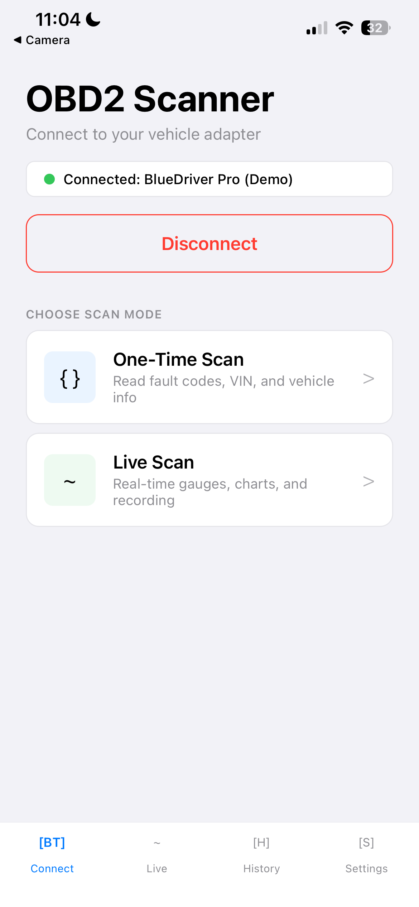

# BlueDriver OBD2 Scanner

A React Native mobile app that connects to a vehicle's OBD2 port via the BlueDriver Pro Bluetooth adapter. Read diagnostic trouble codes in plain English, monitor real-time engine data on configurable gauges, and export scan reports — all without a subscription.

<p align="center">
  
</p>

## Features

**One-Time Scan**
- Read VIN, ECU calibration ID, and OBD standard
- Check Engine Light (MIL) status detection
- Stored, pending, and permanent DTCs with plain-English descriptions and severity badges
- Freeze frame data captured at time of fault
- Clear fault codes (with confirmation and re-scan)
- Export scan reports via share sheet

**Live Scan**
- Real-time streaming of 13 PIDs: RPM, speed, coolant temp, throttle, engine load, IAT, MAP, timing advance, fuel level, oil temp, STFT, LTFT, MAF
- 4 configurable gauge slots in a 2x2 grid with SVG arc gauges
- Color-coded zones (green / yellow / red) per parameter
- 60-second rolling time-series chart
- Session recording with playback and CSV export

**General**
- Full dark mode support
- Imperial / metric unit switching
- Scan and recording history
- Works completely offline
- Demo mode for UI testing without hardware

## Getting Started

### Prerequisites

- Node.js 18+
- iOS 16+ or Android 10+ device
- [Expo Go](https://expo.dev/go) installed on your device (for demo mode)
- BlueDriver Pro or compatible ELM327 BLE adapter (for real Bluetooth)

### Install & Run

```bash
git clone https://github.com/NathanNam/bluedriver-obd2-scanner.git
cd bluedriver-obd2-scanner
npm install
npx expo start
```

Open Expo Go on your phone and scan the QR code from within the app to load the project.

### Demo Mode vs Real BLE

The app ships in **demo mode** by default so it runs in Expo Go without native Bluetooth modules. Demo mode simulates device discovery, connection, DTC responses, and live PID data with realistic oscillating values.

To enable real Bluetooth:

1. Install the BLE library: `npm install react-native-ble-plx`
2. Set `USE_REAL_BLE = true` in `src/bluetooth/manager.ts`
3. Build with native modules: `npx expo run:ios` or `npx expo run:android`

> Expo Go does not support native BLE modules. A [development build](https://docs.expo.dev/develop/development-builds/introduction/) is required for real adapter connectivity.

## Tech Stack

| Layer | Choice |
|---|---|
| Framework | React Native (Expo SDK 54) |
| Language | TypeScript |
| BLE | `react-native-ble-plx` (optional, for dev builds) |
| OBD2 Protocol | ELM327 AT commands over BLE |
| State | Zustand |
| Gauges / Charts | `react-native-svg` |
| Navigation | React Navigation v6 (stack + bottom tabs) |
| Storage | AsyncStorage |

## Project Structure

```
src/
├── bluetooth/          # BLE connection manager, demo simulator
├── obd2/               # ELM327 commands, PID registry, response parser
├── screens/            # Home, Scan, Live, History, ScanDetail, RecordingDetail, Settings
├── components/         # Gauge, DTCCard, StatusBadge, PIDRow, ConnectionStatusBar
├── store/              # Zustand stores: bluetooth, scan, live, settings
├── navigation/         # Tab + stack navigator config
├── types/              # TypeScript type definitions
└── utils/
    ├── dtc/            # DTC lookup table (~200 codes)
    ├── theme.ts        # Light/dark color tokens
    └── hooks.ts        # useThemeColors hook
```

## Architecture

### Bluetooth Connection FSM

```
IDLE → SCANNING → CONNECTING → INITIALIZING → READY → SCANNING_OBD
  ↑                                              |
  └──────────── DISCONNECTED ←── ERROR ←─────────┘
```

### ELM327 Initialization

On connect: `ATZ` (reset) → `ATE0` (echo off) → `ATL0` (linefeeds off) → `ATH0` (headers off) → `ATSP0` (auto protocol) → `0100` (verify ECU).

### Live PID Polling

PIDs are polled sequentially — the ELM327 is single-threaded and cannot handle concurrent requests. Unsupported PIDs are auto-excluded after a `NO DATA` response. `BUS BUSY` errors retry up to 3 times with 200ms delay.

## Platform Permissions

### iOS (`Info.plist`)
- `NSBluetoothAlwaysUsageDescription`
- `NSBluetoothPeripheralUsageDescription`

### Android (`AndroidManifest.xml`)
- `BLUETOOTH`, `BLUETOOTH_ADMIN`
- `BLUETOOTH_SCAN`, `BLUETOOTH_CONNECT` (API 31+)
- `ACCESS_FINE_LOCATION` (required for BLE scan on Android < 12)

## License

Copyright 2026 Nathan Nam. Licensed under the Apache License, Version 2.0 — see [LICENSE](LICENSE) for details.
