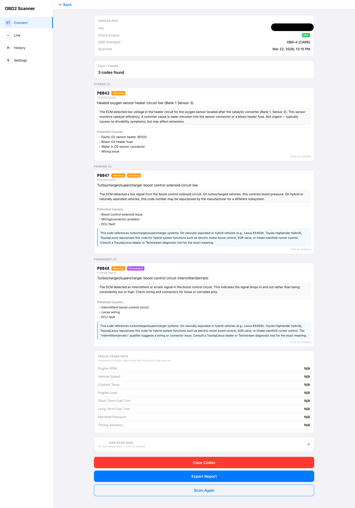
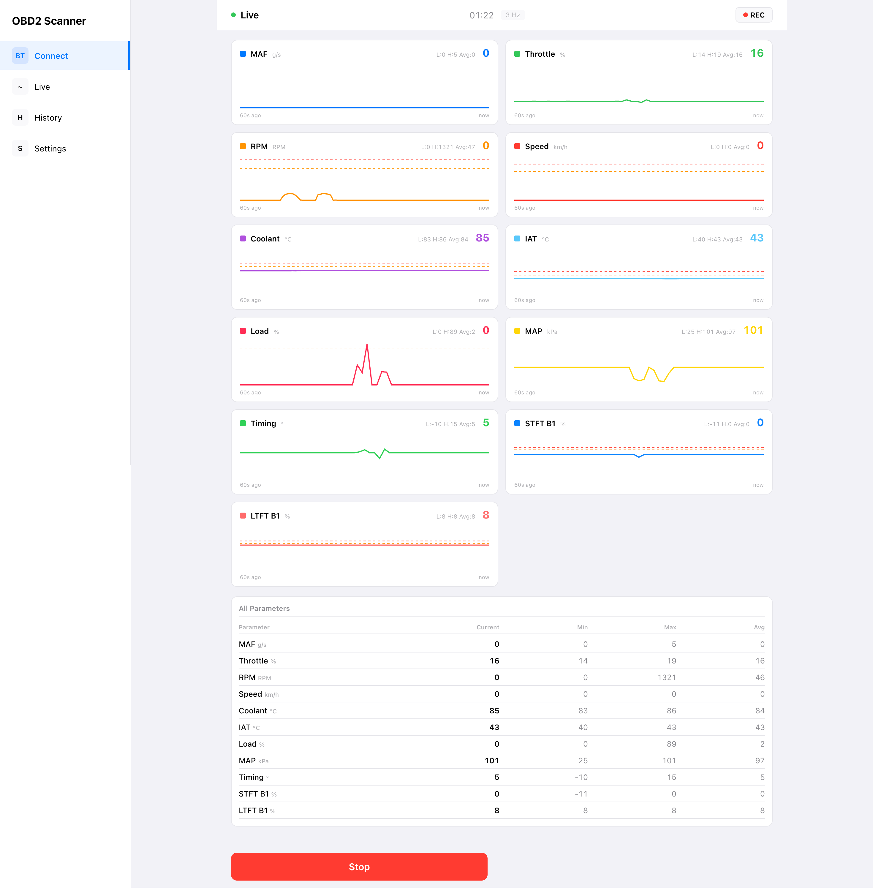
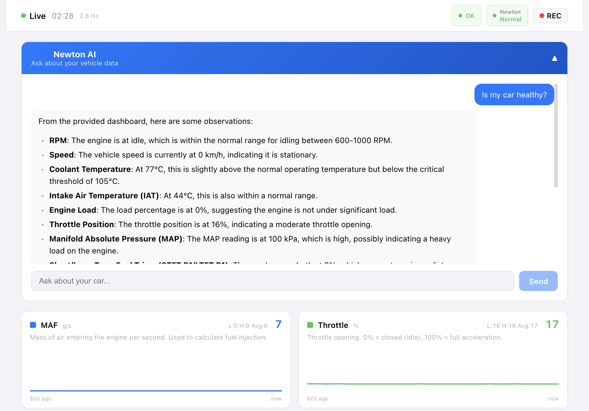

# OBD2 Scanner

A web app that connects to your vehicle's OBD2 port via an ELM327 Bluetooth adapter — directly from your browser using the Web Bluetooth API. Read diagnostic trouble codes in plain English, monitor real-time engine data with time-series charts, and get AI-powered vehicle health analysis with Newton.

<p align="center">
  
</p>

<p align="center">
  
</p>

## Features

**One-Time Scan**
- Read VIN, ECU calibration ID, and OBD standard
- Check Engine Light (MIL) status detection
- Stored, pending, and permanent DTCs with plain-English descriptions, severity badges, and potential causes
- Manufacturer-specific code hints (e.g., Toyota/Lexus hybrid-repurposed codes)
- Freeze frame data captured at time of fault
- Collapsible raw scan data log showing every OBD2 command and response
- Clear fault codes (with confirmation and re-scan)
- Export scan reports via share or clipboard

**Live Scan**
- Real-time streaming of 13 PIDs: RPM, speed, coolant temp, throttle, engine load, IAT, MAP, timing advance, fuel level, oil temp, STFT, LTFT, MAF
- Stacked time-series charts — one per parameter with 60-second rolling window
- Plain-English description for each parameter
- Caution and critical threshold lines on each chart
- Session stats: min, max, and average tracked per PID
- Alert banner when values cross critical thresholds
- Refresh rate indicator (Hz) in the header
- Numerical data table with all parameters and min/max/avg
- Session recording with playback and CSV export
- Dual health indicators: local threshold check + Newton AI classification

**Newton AI (Optional)**

Powered by [Archetype AI](https://archetypeai.dev), Newton provides AI-driven vehicle health analysis. Requires an API key — the app works fully without it.

<p align="center">
  
</p>

- **Health Indicator**: Real-time classification of vehicle health (Normal/Attention) using the Machine State Lens, displayed alongside a local threshold-based health check
- **Chat**: Ask questions about your vehicle data — "Is my car healthy?", "Explain the sensor readings", "Any concerns?". Newton captures the live dashboard charts, analyzes them with its vision model, and responds in natural language
- **How it works**: Live PID data is streamed as CSV to Newton's Machine State Lens for continuous classification. Chat questions trigger a screenshot of the dashboard, converted to video, and sent to Newton's Activity Monitor Lens for visual analysis

**General**
- Full dark mode support (follows system preference or manual toggle)
- Imperial / metric unit switching
- Responsive layout: sidebar navigation on desktop, bottom tabs on mobile
- Scan and recording history
- Works completely offline after initial load
- Built-in demo mode with simulated OBD2 data for testing without hardware

## Supported Adapters

| Adapter | Protocol | Status |
|---|---|---|
| Veepeak OBDCheck BLE+ | ELM327 v2.2 over BLE | Tested, works |
| Veepeak OBDCheck BLE | ELM327 v1.4 over BLE | Should work |
| Generic ELM327 BLE adapters | ELM327 over BLE | Should work |
| BlueDriver Pro | Proprietary | Not compatible (proprietary protocol) |
| OBDLink MX+ | Bluetooth Classic (SPP) | Not compatible (Web Bluetooth requires BLE) |

## Getting Started

### Prerequisites

- **Chrome or Edge** browser (Web Bluetooth is not supported in Safari or Firefox)
- ELM327 BLE adapter (e.g., Veepeak OBDCheck BLE+)
- Node.js 18+ (for development)

### Install & Run

```bash
git clone https://github.com/NathanNam/bluedriver-obd2-scanner.git
cd bluedriver-obd2-scanner
npm install
npm run dev
```

Open http://localhost:3000 in Chrome. The app starts in **demo mode** with simulated OBD2 data — no adapter needed.

### Connecting to a Real Vehicle

1. Plug your ELM327 BLE adapter into the car's OBD2 port (under the dashboard, driver side)
2. Turn ignition ON (engine running or accessory mode)
3. Open the app in Chrome at http://localhost:3000
4. Click **"Use Real BT"** to switch from demo mode
5. Click **"Scan for Devices"** — Chrome shows its native Bluetooth device picker
6. Select your adapter and click Pair
7. Click the device in the Discovered Devices list to connect
8. Choose **One-Time Scan** or **Live Scan**

### Newton AI Setup (Optional)

1. Get an API key from [Archetype AI](https://archetypeai.dev)
2. Create `.env.local` in the project root:
   ```
   ATAI_API_KEY=your_api_key_here
   ATAI_API_ENDPOINT=https://api.u1.archetypeai.app/v0.5
   ```
3. Restart the dev server — Newton features appear automatically in Live Scan

## Tech Stack

| Layer | Choice |
|---|---|
| Framework | Next.js 14 (App Router) |
| Language | TypeScript |
| Bluetooth | Web Bluetooth API |
| OBD2 Protocol | ELM327 AT commands over BLE |
| AI | Archetype AI (Newton) — Machine State Lens + Activity Monitor Lens |
| State | Zustand |
| Charts | Inline SVG time-series |
| Styling | Inline styles with theme system |

## Project Structure

```
app/
├── layout.tsx              # Root layout
├── page.tsx                # Client-side app entry
└── api/newton/             # Newton AI API routes
    ├── status/             # Check if API key configured
    ├── query/              # Chat: screenshot → video → analysis
    └── stream/             # Health indicator: CSV data → classification
src/
├── bluetooth/              # Web Bluetooth manager + demo simulator
├── obd2/                   # ELM327 commands, PID registry, response parser
├── screens/                # Home, Scan, Live, History, Settings, detail screens
├── components/             # Gauge, DTCCard, NewtonChat, NewtonIndicator, etc.
├── hooks/                  # useNewtonStatus, useNewtonChat
├── store/                  # Zustand stores: bluetooth, scan, live, settings
├── lib/                    # newton-stream (Machine State Lens), captureScreen
├── types/                  # TypeScript type definitions
└── utils/
    ├── dtc/                # DTC lookup table (~200 codes)
    ├── theme.ts            # Light/dark color tokens
    └── hooks.ts            # useThemeColors, useWindowWidth
```

## Architecture

### Bluetooth Connection FSM

```
IDLE → SCANNING → CONNECTING → INITIALIZING → READY → SCANNING_OBD
  ↑                                              |
  └──────────── DISCONNECTED ←── ERROR ←─────────┘
```

### ELM327 Initialization

On connect: `ATZ` (reset) → `ATE0` (echo off) → `ATL0` (linefeeds off) → `ATH0` (headers off) → `ATSP0` (auto protocol) → `0100` (verify ECU).

### Live PID Polling

PIDs are polled sequentially — the ELM327 is single-threaded and cannot handle concurrent requests. Gauge PIDs are polled every cycle; secondary PIDs every 3rd cycle for performance. Unsupported PIDs are auto-excluded after a `NO DATA` response. `BUS BUSY` errors retry up to 3 times with 200ms delay.

### Newton AI Architecture

Two independent Archetype AI lenses:

- **Machine State Lens**: Receives CSV of live OBD2 sensor data every 15 seconds. Uses n-shot classification (normal vs attention car profiles) to classify vehicle health. Results streamed via SSE.
- **Activity Monitor Lens**: Receives a video of the dashboard screenshot (PNG → MP4 via ffmpeg). Analyzes the visual content of charts and data tables. Returns natural language responses to user questions.

## Browser Compatibility

| Browser | Web Bluetooth | Status |
|---|---|---|
| Chrome (desktop & Android) | Yes | Fully supported |
| Edge | Yes | Fully supported |
| Safari | No | Demo mode only |
| Firefox | No | Demo mode only |

## Current Limitations

- **BlueDriver Pro not supported**: Uses a proprietary BLE protocol that doesn't respond to standard ELM327 commands. Requires a generic ELM327 BLE adapter (e.g., Veepeak BLE+).
- **Web Bluetooth only in Chromium**: Safari and Firefox don't support the Web Bluetooth API. The app works in demo mode but cannot connect to real adapters in these browsers.
- **HTTPS required for remote access**: Web Bluetooth requires a secure context. Works on localhost for development; needs HTTPS for deployment.
- **Newton AI n-shot tuning**: The Machine State Lens classification uses synthetic training examples. Real-world accuracy improves with better n-shot CSVs matching actual vehicle data patterns.
- **Freeze frame data**: Some vehicles (particularly hybrids) don't provide freeze frame data via standard OBD2 Mode 02 commands.
- **Hybrid-specific PIDs**: Toyota/Lexus hybrid battery and electric motor data requires manufacturer-specific Mode 22 PIDs not yet implemented.
- **ffmpeg required for Newton Chat**: The Activity Monitor Lens requires video input. The server converts screenshots to MP4 via ffmpeg, which must be installed on the host machine.

## Future Improvements

- **Toyota/Lexus hybrid PIDs**: Add Mode 22 manufacturer-specific PIDs for hybrid battery state of charge, cell voltages, electric motor stats
- **Better Newton n-shot examples**: Train with real-world OBD2 data from various vehicles and conditions for more accurate health classification
- **Persistent storage**: Save scan history, recordings, and settings to localStorage/IndexedDB
- **URL-based routing**: Replace the client-side tab navigation with Next.js file-system routing for shareable URLs
- **Multi-vehicle support**: Save and switch between multiple vehicle profiles
- **Emissions readiness testing**: OBD2 I/M readiness monitor status
- **Real-time DTC monitoring**: Detect new DTCs appearing during a live session
- **Export improvements**: PDF report generation, cloud sync
- **PWA support**: Installable as a Progressive Web App for offline-first mobile experience

## License

Copyright 2026 Nathan Nam. Licensed under the Apache License, Version 2.0 — see [LICENSE](LICENSE) for details.
